# NETWORKWALKS-B083-WK4-PENETRATION-TESTING-REPORT

A penetration test was conducted against the authorized Mediroza General Hospital environment as part of the Networkwalks B083 Week 4 assessment.
> 📌 **Note:** This README is an overview.  
> See the full [Mediroza_report.docx](Mediroza_report.doc) for details.

| **Project Details**    | **Details**                                                                          |
| ---------------------- | ------------------------------------------------------------------------------------ |
| **Pentester Name**     | Debashree Sinha                                                                      |
| **Program / Batch**    | B083-Networkwalks                                                                    |
| **Date**               | 30 September 2026                                                                    |
| **Assessment Type**    | Black-box Web Application Penetration Test                                           |
| **Client / Target**    | **Mediroza General Hospital** — [medirozahospital.com](https://medirozahospital.com) |
| **Authorization**      | Written authorization granted                                                        |
| **Testing Platforms**  | Kali Linux & Windows                                                                 |
| **Testing Duration**   | 3 days                                                                               |
| **Status**             | **Completed**                                                                        |

---

## Table of Contents

1. **Executive Summary**
2. **Scope and Methodology**

   * 2.1 Scope
   * 2.2 Methodology
   * 2.3 Tools Used
3. **Findings and Proof of Exploitation**

   * F-01: SQL Injection / Authentication Bypass
   * F-02: Weak Protection of Patient PDF Reports
   * F-03: Publicly Accessible Database Backup
4. **Risk Rating**
5. **Recommendations and Remediation**
6. **Evidence Appendix**

---

# 01. Executive Summary

A penetration test was conducted against the authorized **Mediroza General Hospital** environment as part of the Networkwalks B083 Week 4 assessment.

The assessment covered reconnaissance, authentication testing, restricted file access, PDF password recovery, and directory enumeration.

Three significant security findings were identified:

* **SQL injection resulting in authentication bypass**
* **Weak protection of confidential patient PDF reports**
* **Public exposure of a historical database backup containing staff and shareholder information**

The findings demonstrate risks to **authentication controls, confidentiality, and sensitive organizational data**. Detailed evidence is maintained separately in the Evidence folder.

---

# 02. Scope and Methodology

## 2.1 Scope

| Item            | Details                            |
| --------------- | ---------------------------------- |
| Target          | `medirozahospital.com`             |
| Assessment Type | Authorized penetration testing     |
| Environment     | Controlled educational environment |
| Duration        | 3 days                             |
| M1 & M3         | Kali Linux                         |
| M2 & M4         | Windows                            |
| Authorization   | Written permission granted         |

The Week 4 assessment consisted of four milestones:

1. Obtain access to the three confidential patient reports.
2. Recover the contents of the protected PDFs.
3. Identify the critical data exposure on the server.
4. Document findings and remediation recommendations.

## 2.2 Methodology

Testing was performed through:

1. **Reconnaissance** — domain, DNS, technology and security-control enumeration.
2. **Authentication Testing** — assessment of the patient portal and user-input handling.
3. **File Access Validation** — verification of access to the restricted reports.
4. **Password Recovery** — assessment of the protection applied to the retrieved PDFs.
5. **Directory Enumeration** — identification of accessible directories and files.
6. **Data Exposure Analysis** — review of the exposed database backup relevant to the assessment requirements.

## 2.3 Tools Used

| Tool                          | Purpose                                |
| ----------------------------- | -------------------------------------- |
| WHOIS                         | Domain and registration information    |
| Nslookup                      | DNS resolution                         |
| cURL                          | HTTP response inspection               |
| WhatWeb                       | Technology identification              |
| Wafw00f                       | WAF detection                          |
| DNSRecon                      | DNS enumeration                        |
| Burp Suite                    | Web request and authentication testing |
| Gobuster                      | Directory and file enumeration         |
| Networkwalks Hash Calculator  | Hash analysis                          |
| Networkwalks Password Cracker | PDF password recovery                  |

---

# 03. Findings and Proof of Exploitation

## F-01 — SQL Injection / Authentication Bypass

**Severity: Critical**

### Description

Testing of the patient portal identified improper handling of user-supplied input during authentication.

Further testing of the username parameter identified a SQL injection condition. A quote/comment sequence (`'--`) altered the authentication query and resulted in successful access without the expected password validation.

### Result

The bypass provided access to the restricted patient portal and exposed **three password-protected laboratory reports**, which were subsequently assessed during M2.

### Evidence

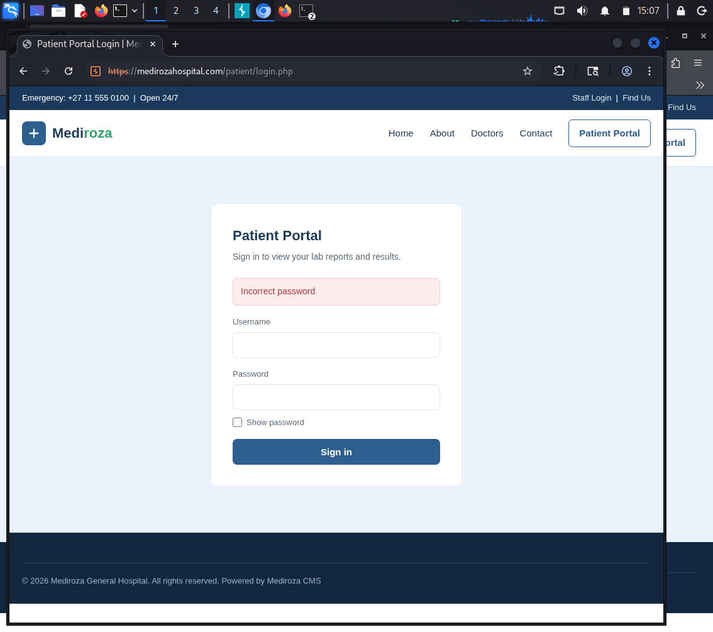
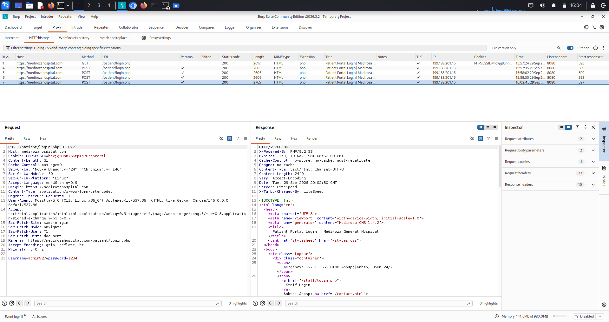
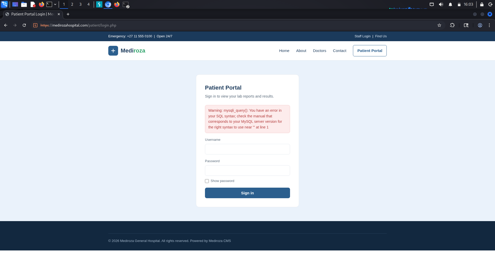
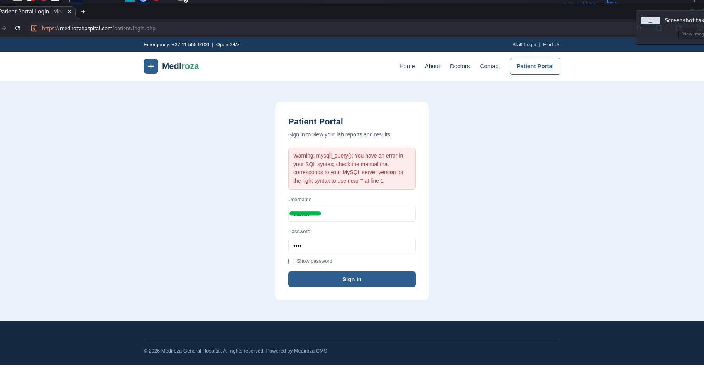
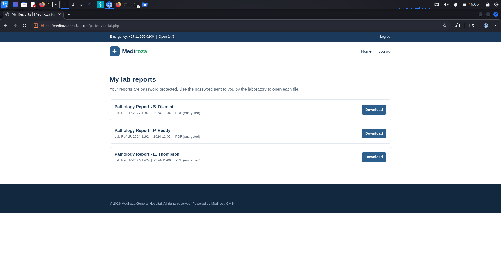

---

## F-02 — Weak Protection of Patient PDF Reports

**Severity: High**

### Description

The three laboratory reports obtained during M1 were password protected. Their protection was assessed during M2 using the provided Networkwalks password-recovery tools.

Two PDFs were recovered during the initial attempt, while the third required additional attempts using the provided wordlist.

### Result

All **three protected reports were successfully opened**, demonstrating that the applied password protection could be overcome using the available recovery approach.

No patient information is reproduced in this README.

### Evidence

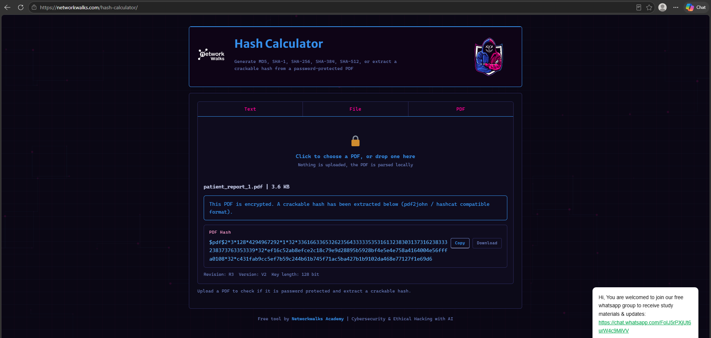
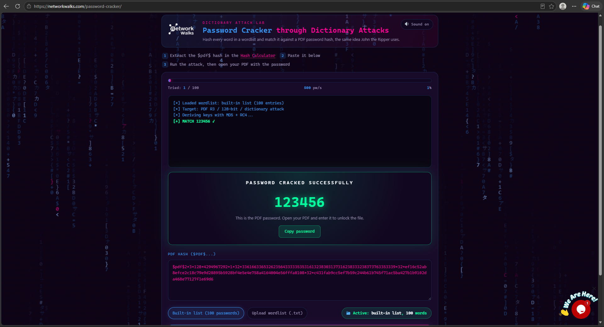
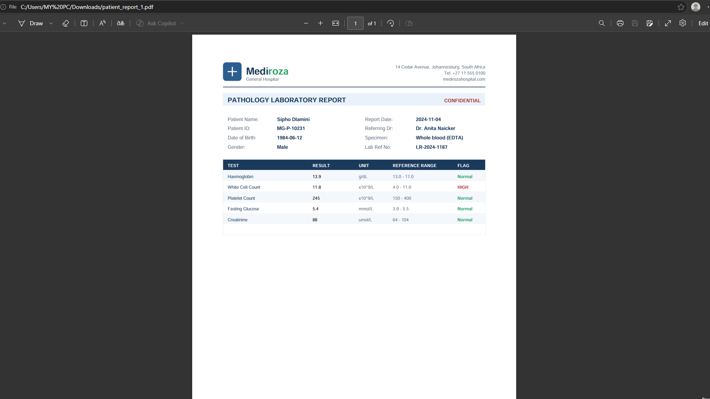
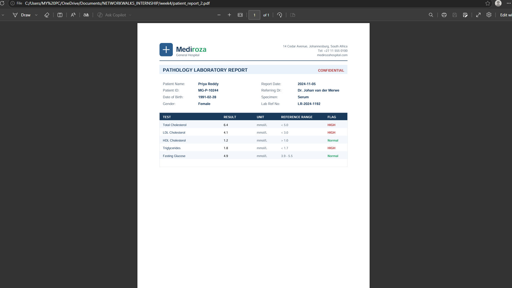
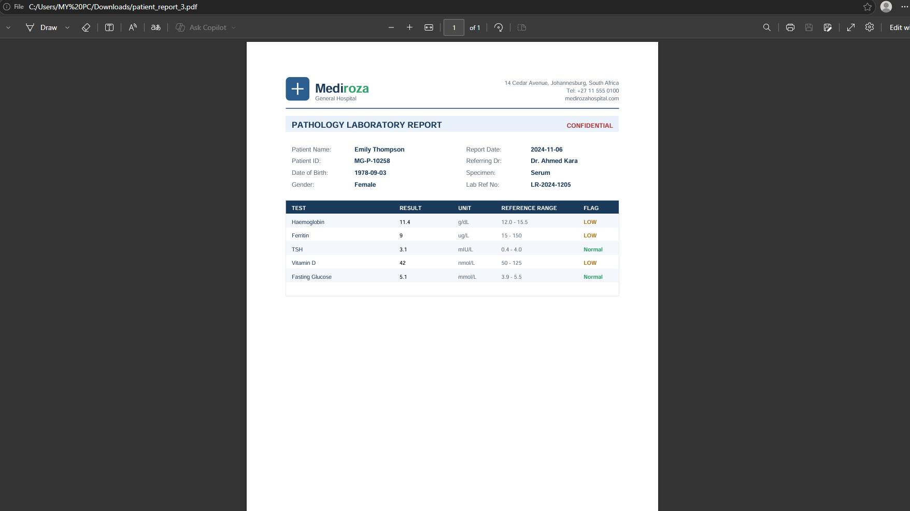

---

## F-03 — Publicly Accessible Historical Database Backup

**Severity: Critical**

### Description

Directory enumeration identified an accessible `/old/` directory containing:

`mediroza_db_backup_2019.sql`

The backup identified itself as an internal Mediroza General Hospital database backup and indicated that it contained confidential staff and shareholder records.

### Exposed Information

The database contained categories including:

**Staff records**

* Names
* Job titles and departments
* Email addresses and phone numbers
* National identification information
* Monthly salaries
* Joining dates

**Shareholder records**

* Shareholder names
* Share percentages
* Shares held
* Share classes

### Result

A historical internal database backup was accessible through the web server without the intended access restrictions.

Actual personal values and identifiers are intentionally omitted.

### Evidence

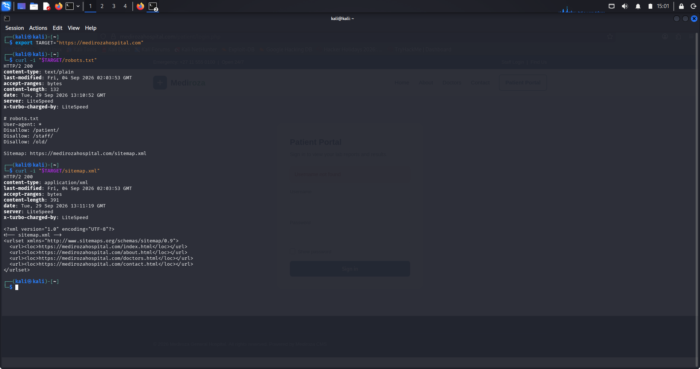
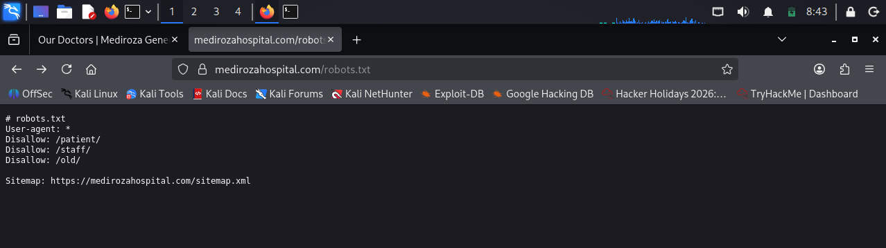
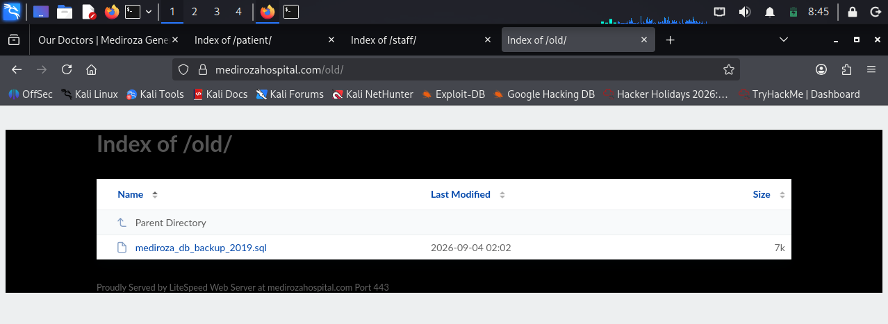
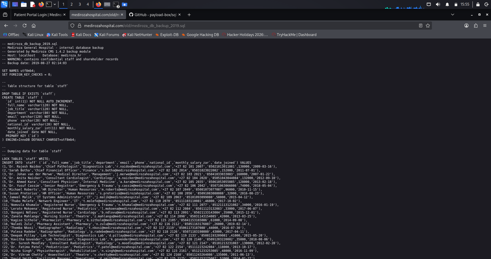
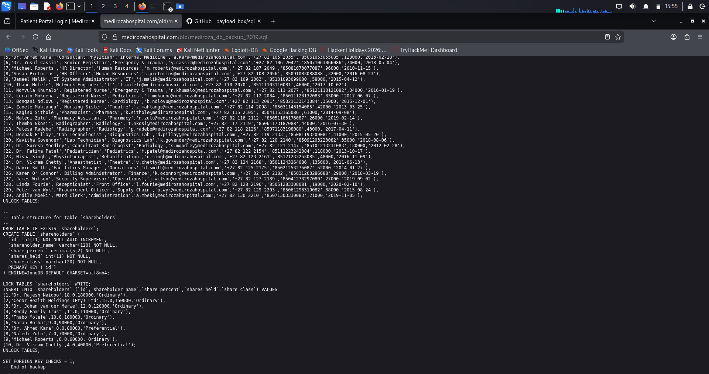

---

# 04. Risk Rating

| ID   | Finding                                | Severity     | Justification                                                                       |
| ---- | -------------------------------------- | ------------ | ----------------------------------------------------------------------------------- |
| F-01 | SQL Injection / Authentication Bypass  | **Critical** | Authentication controls could be bypassed to access restricted patient information. |
| F-02 | Weak Protection of Patient PDF Reports | **High**     | All three protected reports were successfully recovered.                            |
| F-03 | Public Database Backup Exposure        | **Critical** | The accessible backup contained sensitive staff and shareholder information.        |

### Overall Risk Consideration

The findings affect multiple security layers, including **application authentication, document protection, and server-side data exposure**. Remediation should prioritize eliminating unauthorized access paths and removing sensitive information from public reach.

---

# 05. Recommendations and Remediation

## F-01 — SQL Injection / Authentication Bypass

* Use **parameterized queries/prepared statements** for database operations.
* Never construct SQL queries directly from user input.
* Apply server-side input validation.
* Implement secure authentication and session-management controls.
* Perform security testing on authentication endpoints.

## F-02 — Patient PDF Protection

* Use strong, randomly generated passwords or appropriate encryption.
* Avoid predictable or dictionary-based passwords.
* Apply access controls before documents are made available.
* Review and re-secure previously generated patient documents.

## F-03 — Database Backup Exposure

* Remove database backups from publicly accessible web directories.
* Store backups outside the web root.
* Restrict backup access through appropriate permissions and server controls.
* Remove unnecessary historical files from production systems.
* Review `/old/` and other accessible directories for additional sensitive content.
* Protect or rotate sensitive credentials where exposure may have affected them.
* Establish a controlled backup-retention and deletion process.

---

# 06. Evidence Appendix

Original screenshots are maintained separately in the repository's **Evidences** folder, while the detailed assessment is provided in the accompanying report document.

### M1 — Initial Access & Authentication

Evidence includes:

* Reconnaissance results
* Patient portal testing
* Burp Suite request/response inspection
* Authentication bypass result
* Access to the three laboratory reports

### M2 — PDF Password Recovery

Evidence includes:

* Hash/password analysis
* Password-recovery attempts
* Successful recovery of all three PDF passwords
* Opened laboratory reports

### M3 — Critical Data Exposure

Evidence includes:

* `robots.txt` findings
* `/old/` directory listing
* `mediroza_db_backup_2019.sql`
* Staff database records
* Shareholder database records

### M4 — Reporting

The M4 milestone consolidated the methodology, findings, risk ratings, remediation recommendations, and supporting evidence from M1–M3.

---

## Conclusion

This README provides an overview of the penetration testing report. A detailed report is available as a **DOC file** attached in this repository.

The assessment identified three significant weaknesses within the authorized Mediroza Hospital environment.
The testing demonstrated that weaknesses in **authentication input handling, document protection, and publicly accessible backup files** could expose confidential information.
The findings, remediation recommendations, detailed report, and supporting evidence have been documented to support security improvement and remediation.

## Author

### Debashree Sinha

**Cybersecurity Learner | Building Strong Foundations in Networking, Linux & Python**

---
